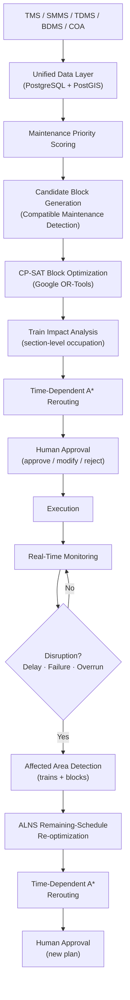

# Credence — Intelligent Railway Block Planning & Dynamic Train Rerouting

> **SIH 2026 · Problem Statement SIH26027**
> AI-Powered Automatic Block Planning to Maximize Asset Availability on Indian Railways

---

## The Problem

Indian Railways coordinates maintenance across three independent departments — **Engineering/Track**, **Signal & Telecommunication (S&T)**, and **Traction/OHE** — each issuing block requests through its own channel (SMMS, TDMS, BDMS). At the same time, the operational layer (TMS, COA) must keep trains running, which depends on track availability, timetable adherence, asset condition, crew and machinery availability, existing blocks, and continuously changing operational conditions.

Planning a single block manually already involves balancing dozens of constraints. Planning a full day of maintenance across all three departments, for an entire section, while minimizing train disruption, is combinatorially hard. When a track failure or block overrun occurs mid-execution, the entire remaining plan must be reconsidered in real time.

**Credence is a decision-support and optimization layer** that sits on top of existing railway operational systems. It does not replace TMS, SMMS, TDMS, BDMS, or COA, and it does not automate safety-critical decisions. It ingests the outputs of those systems, computes the best feasible plan from the current moment onward, explains its reasoning, and presents it for human approval.

---

## System Workflow



The central question the system answers at every step:

> **"Given the current railway situation, what is the best feasible plan from now onward?"**

---

## Core Algorithms

### 1 · Maintenance Priority Scoring

Each maintenance job receives an explainable, weighted score:

```
Priority = (Criticality × 0.25) + (Risk × 0.25) + (Urgency × 0.15)
         + (Operational Impact × 0.15) + (Overdue × 0.10) + (Availability Impact × 0.10)
```

All inputs are normalized to `[0, 1]` using domain-bounded Min-Max scaling. The **risk sub-score** combines asset failure probability, condition score (inverted), and historical failure count.

The engine outputs a `feature_contributions` breakdown for every job so planners can verify exactly why a job was ranked high or deferred. Jobs are then categorized: **HIGH** (≥ 0.70), **MEDIUM** (0.40–0.70), **LOW** (< 0.40).

The architecture isolates the risk component — when real historical failure data is available, the rule-based risk function can be replaced with a trained ML model without disrupting the rest of the priority pipeline.

### 2 · Candidate Block Generation (Compatible Maintenance Detection)

Before optimization, the system generates a pool of *candidate blocks* — proposed, validated possessions that combine one or more maintenance jobs from any department into a single executable window.

Two jobs are candidates for combination if they satisfy **all** of:

- Same track section, combined chainage span ≤ 5 km
- Combined sequential duration fits within operational window (< 12 h)
- No resource quantity conflict
- `compatibility_rules` table permits the asset-type pair (conservative: no explicit rule → rejected)
- No overlap with hard-blocked windows in `track_availability`

Every job also generates a single-job fallback candidate, ensuring the optimizer always has an option. Combinations of up to three jobs are explored. CP-SAT selects the actual schedule from this pool.

> Cross-department coordination (Engineering + S&T + TRD under one block) is fully supported where compatibility rules pass.

### 3 · CP-SAT Block Optimization

Google OR-Tools CP-SAT is the primary scheduling optimizer. It selects a non-overlapping, feasible subset of candidate blocks that maximizes maintenance effectiveness while minimizing operational disruption.

**Hard constraints:**
- Each job must be scheduled exactly once or explicitly deferred (deferral is always an option, not a failure)
- No two selected blocks on the same track may overlap in time (`AddNoOverlap`)
- No selected block may overlap with a hard-blocked track window
- Job dependency ordering: if B depends on A, then end(A) ≤ start(B)
- Cumulative resource capacity enforced via `AddCumulative`

**Objective (soft constraints):** maximize a weighted sum of priority rewards for scheduled jobs, minus penalties for deferral (scaled to priority), train impact, and unnecessary block fragmentation.

The solver outputs its status (`OPTIMAL` / `FEASIBLE` / `INFEASIBLE`), selected blocks with start/end times, and explicitly deferred jobs with reasons.

### 4 · Train Impact Analysis

Train schedules are stored section-by-section in `train_timetable` (each row: `train_id`, `track_id`, `entry_time`, `exit_time`). The system checks each planned block against these occupation intervals to identify affected trains — not just by origin and destination, but by which specific track section is occupied at which time.

In the current prototype, a lightweight spatial-temporal overlap heuristic drives the CP-SAT objective. A full TDSP simulation (Step 5) then evaluates the selected schedule more precisely.

### 5 · Time-Dependent A* Train Rerouting

The railway network is modeled as a time-dependent graph:

- **Nodes** — stations
- **Edges** — track sections, with travel time derived from distance and speed limit

When a block is placed on a section during `[start, end]`, any train arriving at the entry station at time *t* where *start ≤ t < end* cannot traverse that section immediately.

The pathfinder evaluates two strategies per affected train:

- **Wait** at the entry station until the block clears, accumulating delay
- **Reroute** via an alternate sequence of track sections, if `can_be_rerouted = True` and an earlier-arriving alternate path exists

Impact scores weight delay by `train_priority`, so delaying a Rajdhani Express incurs a much higher penalty than delaying a freight train. If delay exceeds `max_allowed_delay_min`, the route is marked infeasible, escalating the disruption severity.

Multi-train conflict resolution (Conflict-Based Search) is identified as an advanced extension for when rerouted trains interact with each other.

### 6 · Real-Time Monitoring

The system monitors:

- Train position and running delay (`train_live_status`)
- Track operational status and active block (`track_live_status`)
- Asset health indicators
- Block execution progress (actual start, end, crew, notes)
- Unplanned events (`realtime_events`)

Disruption types handled: track failure, signal fault, OHE failure, train delay or breakdown, block overrun, equipment failure, emergency maintenance, track restoration.

In the prototype, disruption events are injected via the live-events API (`POST /api/events`) rather than from a live railway feed.

### 7 · ALNS Dynamic Re-optimization

When a disruption occurs, Credence does **not** rebuild the entire historical schedule. Past and completed operations are frozen. Only the remaining schedule from *now* onward is re-optimized.

ALNS (Adaptive Large Neighborhood Search) wraps around CP-SAT and TDSP:

1. **Destroy** — Remove 10–30% of remaining blocks via: Random Removal, Worst-Contribution Removal (high possession / low priority), or High-Train-Impact Removal
2. **Repair** — Re-run CP-SAT with a 1-second limit, with preserved blocks as hard locks. Repair strategies: *Greedy Priority Repair* or *Least Impact Repair*
3. **Accept** — Better solutions always accepted; worse solutions accepted with probability e^(−Δ/T) via simulated annealing
4. **Adapt** — Operators that find improvements are rewarded; selection probabilities update dynamically

The new maintenance/block plan is then passed to Time-Dependent A* to recalculate routes for all affected trains. The combined plan is presented for human approval before execution resumes.

---

## Data Model

Credence uses a unified railway planning schema across 17+ entities in PostgreSQL + PostGIS.

| Domain | Tables |
|---|---|
| Infrastructure | `stations`, `track_sections`, `division_boundary_sections` |
| Assets | `assets` |
| Train Operations | `trains`, `train_timetable`, `goods_forecast` |
| Maintenance | `maintenance_jobs`, `maintenance_dependencies`, `compatibility_rules`, `block_requests` |
| Resources | `resources`, `job_resources` |
| Availability | `track_availability` |
| Real-Time | `realtime_events`, `train_live_status`, `track_live_status` |
| Operational (runtime) | `block_status_log`, `block_execution`, `live_events`, `audit_logs` |

**Key relationships:**

```
STATION → TRACK SECTION → ASSET → MAINTENANCE JOB → BLOCK REQUEST → CANDIDATE BLOCK

TRACK SECTION + MAINTENANCE JOB → train_timetable overlap → TRAIN IMPACT

TRAIN IMPACT + CANDIDATE BLOCK → CP-SAT → OPTIMIZED BLOCK SCHEDULE

REALTIME EVENT → affected tracks  → TRAIN LIVE STATUS → A* → NEW ROUTES
                               ↓
                       affected blocks → ALNS → NEW BLOCK SCHEDULE
```

### Dataset Sourcing

No single public dataset integrates TMS + SMMS + TDMS + BDMS + COA data for an Indian Railways section. This prototype uses:

- Synthetic but structurally realistic data: 12 stations, 22 track sections, 12 trains, 108 timetable entries, 58 assets, 38 maintenance jobs, 38 block requests, resources, dependencies, and compatibility rules
- Simulated real-time events and live train/track status
- Project-defined goods forecast data

All synthetic data follows the finalized project schema and railway terminology. It is structured to exercise the actual optimization pipeline, not to serve as placeholder demo data. Production deployment would require integration with actual railway operational databases.

---

## Application & User Experience

### Role-Based Access

| Role | Application Access |
|---|---|
| `SECTION_CONTROLLER` | Command dashboard, block plan, trains, live monitoring, assets, analytics, reports, requests |
| `BDMS_INCHARGE` | Block planning, live monitoring, block requests |
| `FIELD_MANAGER` | Field execution view only |

### Application Areas (Implemented)

**Command Dashboard (`/command`)**
Section Controller overview: pending approvals, active blocks, running events, key metrics (affected trains, total delay, priority-weighted impact). Approval actions (approve / modify / reject) are persisted to the database with an audit log.

**Block Plan (`/plan`)**
Maintenance job list with priority scores, categories, and filter/sort controls. Optimized block schedule with Gantt-style timeline, block details, affected trains, bundled-job breakdown, alternative time windows, and reasoning. Block status lifecycle: `DEMANDED → AI-OPTIMIZED → APPROVED → ACTIVE → COMPLETED`.

**Trains (`/trains`)**
Train list with live delay status. Train detail view with section-by-section route, rerouting status, and conflict indicators.

**Live Monitoring (`/live`)**
Live event feed for tracks and trains. Map-based network view (Leaflet). Event detail with severity, affected assets, and estimated resolution. Reoptimization trigger and result display.

**Assets (`/assets`)**
Asset inventory with condition scores, failure probability, availability, and maintenance history linkage.

**Analytics (`/analytics`)**
Operational charts (block utilization, delay trends, department comparison, priority distribution). Integrated What-If simulation tool.

**Reports (`/reports`)**
PDF and Excel export of maintenance schedules, block summaries, disruption logs, and productivity metrics.

**Block Requests (`/requests`)**
Department-level block request submission form with validation. Request status tracking.

**Field Execution (`/field`)**
Field manager view of approved blocks: location, planned window, crew allocation, actual start/end recording, completion status, and progress tracking.

---

## Explainability

Every major recommendation answers:

- **What is the system recommending?** — specific block, time window, bundled jobs
- **Why?** — which constraints were active, which priority inputs drove the score
- **What is affected?** — which trains, by how much delay, on which sections
- **What changes if I accept?** — asset downtime reduced, maintenance delivered
- **What happens if I reject or modify it?** — deferred work, rescheduling cost, train impact delta

Examples of built-in explanations:
- Priority score breakdown per job: criticality, urgency, risk, overdue, operational impact, availability — with per-feature contribution values
- Block reasoning: *"Scheduled during low-traffic window; Engineering + S&T jobs are spatially compatible; bundling 2 jobs reduces repeated possession; train impact: 0 min"*
- Deferral reason: *"No feasible window within planning horizon without conflicting with a higher-priority block on the same track"*
- Rerouting reason: *"Train would incur 47-minute delay waiting; alternate path via SK–KR–NS arrives 31 minutes earlier"*

---

## What-If Simulation

The Analytics module provides a what-if tool to evaluate scenarios before approval:

- Add or remove a block from the proposed schedule
- Change the duration of a maintenance job
- Introduce a simulated track failure on a section
- Delay a specific train
- Modify resource availability

The system re-evaluates the resulting operational plan and displays the before/after comparison so controllers can test alternatives before committing.

---

## Tech Stack

### Frontend

| Technology | Purpose |
|---|---|
| React 18 + TypeScript | UI framework |
| Vite 5 | Build tool and dev server |
| Tailwind CSS 3 | Utility-first styling |
| Framer Motion | Animations and transitions |
| React Router v6 | Client-side routing with role guards |
| Zustand | State management |
| Recharts | Operational charts and analytics |
| React Leaflet + Leaflet | Network map |
| React Hook Form | Block request forms |
| date-fns | Date/time utilities |
| jsPDF + xlsx | Report export |
| lucide-react | Icons |
| sonner | Toast notifications |

### Backend (API Server)

| Technology | Purpose |
|---|---|
| Node.js + Express 5 | REST API server |
| PostgreSQL 15 + PostGIS | Relational and spatial database |
| pg (node-postgres) | Database connection pooling |
| Docker Compose | Local PostgreSQL + PostGIS container |

### Optimization Pipeline (Python)

| Technology | Purpose |
|---|---|
| Python 3 | Algorithm implementation |
| Google OR-Tools (CP-SAT) | Constraint-based block scheduler |
| pandas | Data ingestion and transformation |
| SQLAlchemy + psycopg2 | Database access |
| GeoAlchemy2 | PostGIS spatial support |
| alembic | Database schema migrations |
| pytest | Unit tests for algorithm modules |

The Python pipeline runs as an offline process (`run_pipeline.py`). Its output (optimized schedule + train impact results) is cached to `pipeline_cache.json`, which the Express server reads and serves. This keeps the API server lightweight while maintaining full algorithmic capability.

---

## Repository Structure

```
credence_sih26/                   (Frontend — this repo)
├── src/
│   ├── App.tsx                   Routes and role guards
│   ├── api/                      API client utilities
│   ├── components/
│   │   ├── approvals/            Approval panel components
│   │   ├── blocks/               Block card and timeline
│   │   ├── gantt/                Gantt chart
│   │   ├── layout/               AppShell, sidebar, nav
│   │   ├── live/                 Live event components
│   │   ├── network/              Leaflet map
│   │   ├── reports/              Report generators
│   │   └── trains/               Train list and detail
│   ├── contexts/
│   │   └── AuthContext.tsx       Role-based auth context
│   ├── data/                     Fallback static data
│   ├── pages/
│   │   ├── Command.tsx           Section Controller dashboard
│   │   ├── Plan.tsx              Block planning and jobs
│   │   ├── TrainsPage.tsx        Train operations
│   │   ├── Live.tsx              Real-time monitoring
│   │   ├── Assets.tsx            Asset management
│   │   ├── Analytics.tsx         Charts and What-If
│   │   ├── ReportsPage.tsx       Report export
│   │   ├── Requests.tsx          Block request management
│   │   └── FieldExecution.tsx    Field manager view
│   └── types/index.ts            Domain type definitions

credence_sih26_backend/           (Backend — separate repo)
├── backend/
│   └── server.js                 Express REST API
├── src/algorithms/
│   ├── priority/                 Priority scoring engine
│   ├── blocks/                   Candidate block generation
│   ├── scheduler/                CP-SAT optimizer
│   ├── tdsp/                     Time-dependent A* rerouting
│   └── alns/                     ALNS re-optimization
├── data/                         Synthetic CSV datasets (17 files)
├── docs/                         Algorithm documentation
└── alembic/                      DB migrations
```

---

## Setup

### Prerequisites

- Node.js >= 18
- Python >= 3.10
- Docker (for PostgreSQL + PostGIS)

### Frontend

```bash
git clone https://github.com/<org>/credence_sih26.git
cd credence_sih26
npm install
```

Create `.env`:

```env
VITE_API_URL=http://localhost:5000
```

```bash
npm run dev       # Dev server at http://localhost:5173
npm run build     # Production build
npm run preview   # Preview production build
```

### Backend

```bash
git clone https://github.com/<org>/credence_sih26_backend.git
cd credence_sih26_backend

# Start PostgreSQL + PostGIS
docker-compose up -d

# Python dependencies
pip install -r requirements.txt

# DB migrations
alembic upgrade head

# Seed synthetic data
python run_ingestion.py

# Run optimization pipeline
python src/algorithms/run_pipeline.py
# Writes backend/pipeline_cache.json

# Start API server
cd backend
npm install
node server.js    # API at http://localhost:5000
```

Backend `.env`:

```env
DB_HOST=localhost
DB_PORT=5432
DB_NAME=sih26
DB_USER=postgres
DB_PASSWORD=postgres
FRONTEND_URL=http://localhost:5173
PORT=5000
```

---

## Implementation Status

| Component | Status |
|---|---|
| Frontend dashboard (Command) | Implemented |
| Block planning UI (Plan page) | Implemented |
| Train operations page | Implemented |
| Live monitoring and event feed | Implemented |
| Assets, Analytics, Reports pages | Implemented |
| Block requests form and tracking | Implemented |
| Field execution view | Implemented |
| Role-based routing (3 roles) | Implemented |
| Human approval workflow | Implemented |
| Audit log for approval actions | Implemented |
| PostgreSQL + PostGIS database | Implemented |
| Synthetic dataset (17 CSVs, schema-compliant) | Implemented |
| Data ingestion and Alembic migrations | Implemented |
| Maintenance priority scoring engine | Implemented (Python) |
| Candidate block generation | Implemented (Python) |
| CP-SAT block optimization | Implemented (Python, OR-Tools) |
| Train impact analysis (section-level) | Implemented (Python) |
| Time-dependent A* rerouting | Implemented (Python) |
| ALNS re-optimization engine | Implemented (Python) |
| Pipeline to API integration (cache) | Implemented |
| What-If simulation | Implemented (UI-driven) |
| Disruption event injection | Implemented (simulated via API) |
| Live railway data feeds (TMS/SMMS/etc.) | Not available — prototype uses synthetic data |
| Real-time GPS / IoT train tracking | Not available |
| Full multi-train conflict resolution (CBS) | Designed — advanced extension |
| ML-driven predictive risk scoring | Architecture ready — requires real historical data |
| Production network-scale deployment | Future |

---

## Limitations

- All operational data is synthetic. The prototype exercises the real optimization pipeline against schema-compliant data, but does not reflect any specific Indian Railways section.
- Real-time events are injected via API, not from live railway feeds.
- TDSP rerouting is based on the synthetic track graph; actual signaling and interlocking constraints are not encoded.
- Human approval is always required before any plan is executed. Credence does not automate operational decisions.
- The optimization pipeline runs offline and caches its output. Automatic re-triggering on live disruption events is architecturally designed but not yet wired end-to-end.
- Network-scale deployment across divisions would require data federation and integration with production railway-operational databases.

---

## What Makes Credence Different

| Differentiator | Description |
|---|---|
| Unified multi-department planning | Single optimization layer across Engineering, S&T, and Traction |
| Explainable priority scoring | Per-feature contribution breakdown for every job score |
| Constraint-based optimization | CP-SAT guarantees hard safety and operational constraints |
| Computational compatibility detection | Systematic candidate generation with explicit safety rules |
| Section-level train impact | Timetable checked track section by section, not origin-to-destination |
| Dynamic train rerouting | Time-dependent A* evaluates wait vs. reroute per train |
| Remaining-schedule re-optimization | ALNS freezes past work; re-plans only from now onward |
| Combined disruption recovery | Maintenance rescheduling and train rerouting solved together |
| What-If simulation | Test scenario impact before approving any change |
| Human-in-the-loop | AI recommends; authorized personnel decide |
| Audit trail | All approval, rejection, and modification actions are logged |

---

## Future Directions

- **Richer train-conflict resolution** — Conflict-Based Search for interacting rerouted trains
- **Predictive asset risk** — failure-probability model trained on actual maintenance history
- **Live feed integration** — real TMS / SMMS / TDMS event streams
- **GIS and IoT integration** — real-time GPS train positioning and track sensor feeds
- **Rolling-stock maintenance** — extend model to coach and locomotive availability
- **Multi-division coordination** — federated planning across division boundaries
- **Post-execution feedback loop** — actual vs. planned block utilization feeds back into priority weights

---

## Project Context

**Problem Statement:** SIH26027 — AI-Powered Automatic Block Planning to Maximize Asset Availability on Indian Railways
**Event:** Smart India Hackathon 2026
**Team:** Credence

---

*This README describes the complete Credence system — its design, algorithms, data model, and current prototype implementation — so that any evaluator, developer, or collaborator can understand the full scope of the solution by reading this file.*
